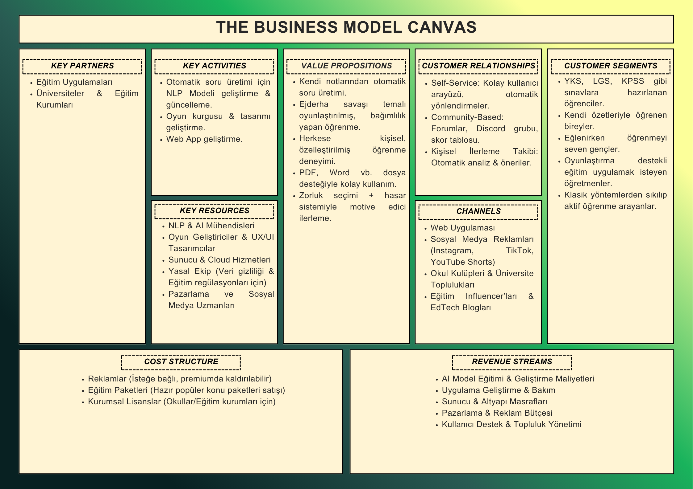

# Takım İsmi
***Grup 158***

# Takım Rolleri

| 
İsim
   | 
Görev

|  :---------- | :---------- |
|  Çağan Atan     | Product Owner     | 
|  Aydanur Tokmak     | Scrum Master     | 
|  Ömer Faruk Karakurt      | Developer    
|  Hümeyra Özturk      | Developer     |

# Ürün Logosu

# Ürün İsmi
***Academyth***

# Ürün Açıklaması
Bu uygulama, kullanıcıların kendi çalışma materyallerini yükleyerek (PDF gibi), bu içeriklere dayalı interaktif bir oyun deneyimi yaşamalarını sağlayan bir eğitim teknolojisi ürünüdür. Temel amaç, kullanıcıların öğrenme süreçlerini pekiştirmek için oyunlaştırma öğelerinden faydalanmaktır.
Temel Özellikler:
- **Kullanıcı Materyali Tabanlı Soru Üretimi**: Kullanıcı tarafından yüklenen dokümanlardan (ders notları, özetler, makaleler vb.) doğal dil işleme teknikleri ile otomatik olarak çoktan seçmeli sorular üretilir.
- **Oyunlaştırılmış Öğrenme Deneyimi**: Sistem, bir "ejderha savaşı" teması çerçevesinde soruları sunar. Kullanıcı, her soru öncesinde bir zorluk seviyesi seçer. Doğru cevaplar, seçilen zorluk seviyesine göre sanal ejderhaya hasar verilmesini sağlar. Yanıtlar, oyunun ilerleyişini etkileyerek hem motivasyonu artırır hem de öğrenme sürecini destekler.
- **Zorluk Seviyesi ve Performansa Dayalı Geribildirim**: Sorular üç farklı zorluk kategorisine ayrılmıştır: Kolay, Orta ve Zor. Kullanıcının seçtiği seviyeye göre sorudan elde edilen puan ve verilen hasar değişkenlik gösterir. Bu yapı, öğrencinin hem kendi seviyesini belirlemesine hem de konuları farklı derinliklerde çalışmasına olanak tanır.
- **Amaç Odaklı Oyun Kurgusu**: Oyunun nihai hedefi, belirli bir can puanına sahip olan ejderhayı sorular aracılığıyla "yenmektir". Tüm sorular başarıyla tamamlandığında, hem konular tekrar edilmiş olur hem de kullanıcıya görsel ve sayısal performans geribildirimi sunulur.

# İş Modeli Kanvası

# Ürün Özellikleri
**Çalışma Materyali Yükleme**
- Kullanıcılar PDF, Word (.doc/.docx) ve benzeri dosya formatlarında kişisel çalışma materyallerini sisteme yükleyebilir.
- Yüklenen içerikler yerel olarak analiz edilerek güvenli ve özelleştirilmiş bir öğrenme deneyimi sunar.

**Otomatik Soru Üretimi**
- Doğal dil işleme (NLP) teknolojisi ile içeriklerden anlamlı ve bilgiye dayalı çoktan seçmeli sorular otomatik olarak oluşturulur
- Sorular, temel bilgi, kavrama ve analiz düzeylerini kapsayacak şekilde çeşitlendirilir.

**Oyunlaştırma Temelli Öğrenme Deneyimi**
- Oyunun ana kurgusu, kullanıcının bir ejderhaya karşı savaşması üzerine kuruludur.
- Her doğru cevap, ejderhanın can puanını azaltır; yanlış cevaplar ise kullanıcının canından eksiltir.

**Zorluk Seviyesi Seçimi**
- Kullanıcı, her soru için "Kolay", "Orta" veya "Zor" zorluk seviyelerinden birini seçebilir.
- Seçilen zorluk seviyesi, sorunun karmaşıklığını ve doğru cevap verildiğinde ejderhaya verilecek hasarı etkiler.

**Performans ve Geri Bildirim**
- Kullanıcının doğru/yanlış yanıtları, zorluk tercihleri ve toplam ilerlemesi detaylı olarak raporlanır.
- Oyun sonunda genel başarı durumu, eksik öğrenme alanları ve tekrar edilmesi önerilen konular hakkında özet sunulur.

**Konuya Özgü Kişiselleştirme**
- Her oyun, sadece kullanıcının yüklediği içeriğe özel sorular içerir. Böylece gereksiz genel bilgi yerine, hedeflenen materyal üzerinde öğrenme gerçekleşir.

# Hedef Kitle
- Sınavlara hazırlık (Üniversite, LGS, YKS, KPSS vb.) sürecinde olan öğrenciler.
- Ders materyallerini kendi oluşturduğu notlardan çalışmayı tercih eden bireyler.
- Tekrar yaparken motivasyon ve odaklanma sorunu yaşayan öğrenciler.
- Eğitimde oyunlaştırma ve interaktif öğrenme gibi kavramlara değer veren eğitimciler.
- Klasik test çözümlerinden sıkılmış, aktif öğrenme yöntemlerine açık bireyler.

# Product Backlog 

https://trello.com/b/esRn5hb3

    
<h1>Ekran Görüntüleri</h1>

  

# Ürün Demo Videosu

  
<h1>Sprint 1</h1>

  <!-- Küçük açılır başlıklar -->

  

  

    
<h3>Project Management</h3>

  

  

    
<h3>Burndown Chart</h3>

  

  

    
<h3>UI Draft</h3>

    

  

    
<h3>Toplantılar</h3>

  
### Tarih Aralığı
***20 Haziran*** - ***6 Temmuz***

**Sprint Notları**

* UI tasarımlarında **sade ve işlevsel bir arayüz** kullanılmasına karar verildi.
* Proje yönetim aracı olarak **Trello** kullanılmasına karar verildi.
* Daily scrum toplantılarının Google Meet üzerinden yapılmasına karar verildi.
* Giriş sistemi için **detaylı çalışmalar henüz başlamadı, ancak güvenli bir kimlik doğrulama yöntemi (örneğin e-posta/şifre veya sosyal medya entegrasyonu)** kullanılması planlanmaktadır.
* Uygulamanın asıl temasının **oyunlaştırılmış öğrenme deneyimi sunan bir yapı ** olmasına karar verildi.
* Uygulamanın dilinin **Türkçe** yapılmasına karar verildi.

**Sprint İçinde Tamamlanması Beklenen Puan:** 300 Puan

**Puan Tamamlama Mantığı:**
Toplamda 1200 puanlık bir hedef belirlendi. Sprint-1'de 300 puanlık bir hedef belirlenmiş ve tamamlanmıştır. Sprint-2 ve Sprint-3'te projenin **API kod entegrasyonu, backend geliştirme, otomatik soru üretim mekanizmaları ve kullanıcı ilerleme takibi** kısımlarına yoğunlaşılacağı için 450 hedef puanı olmasına karar verildi.

**Sprint Gözden Geçirilmesi (Sprint Review)**

**Katılımcılar:** Çağan Atan (Product Owner), Aydanur Tokmak (Scrum Master), Ömer Faruk Karakurt (Developer), Hümeyra Öztürk (Developer)

**Genel Değerlendirme:**
Sprint 1, belirlenen hedefler doğrultusunda başarılı bir şekilde tamamlanmıştır. Takım, başlangıç aşamasındaki temel yapılandırmaları, ilk kullanıcı ihtiyaç analizlerini ve teknolojik altyapı araştırmalarını etkin bir şekilde yürütmüştür. Trello panosunda görüldüğü üzere, "Done for 1st Sprint" sütunundaki tüm görevler (GitHub Readme'nin araştırılması ve yazılması, Toplantı düzeninin oluşturulması, Frontend teknolojilerinin araştırılması, Backend teknolojilerinin araştırılması) tamamlanmıştır. "To Do" ve "Doing" sütunlarında planlanan bazı görevler ise sonraki sprintlere aktarılmıştır.

**Tamamlanan Ürün Artımları:**

* **Temel Proje Yapılandırması:** GitHub README belgesi oluşturularak projenin genel hatları, amacı ve takımı tanıtılmıştır. Bu, projenin şeffaflığı ve yeni katılımcılar için rehberliği sağlamıştır.
* **Arayüz Taslağı Oluşturulması:** Arayüz için temel ve ana fonksiyonları ele alan bir taslak oluşturulmuştur.
* **Toplantı Düzeni ve İletişim Altyapısı:** Daily Scrum toplantıları için Google Meet kullanımına karar verilerek takım içi iletişimin sürekliliği sağlanmıştır. Trello'nun proje yönetim aracı olarak benimsenmesi, görev takibini ve şeffaflığı artırmıştır.
* **Teknolojik Temel Araştırmaları:** Frontend ve Backend teknolojileri üzerine detaylı araştırmalar yapılmıştır. Bu araştırmalar, uygulamanın teknik mimarisi için sağlam bir temel oluşturacak ve gelecek sprintlerdeki geliştirme kararlarına yön verecektir. Bu sayede, projenin teknik yönelimleri netleşmeye başlamıştır.
* **Kullanıcı Persona Çalışmaları (Kısmen):** Trello'daki "Kullanıcı Personalarının Oluşturulması" görevinin "To Do" kısmında olması, bu alandaki ilk çalışmaların başladığını göstermektedir.
* **Oyun Konsepti ve İsim Belirleme:** Ürün ismi olarak "Academyth" kararlaştırılmış ve ejderha savaşı üzerine oyunlaştırma konsepti netleştirilmiştir.
**Puan Hedefi ve Gerçekleşme:**
Sprint 1 için belirlenen 300 puanlık hedefe ulaşılmıştır. Bu, takımın sprint planlama yeteneğinin ve iş tamamlama kapasitesinin başarılı olduğunu göstermektedir.

**Sprint Retrospektifi**

**Tarih:** 6 Temmuz 2025

* **Etkili Takım İçi İletişim:** Daily Scrum toplantılarının düzenli olarak Google Meet üzerinden yapılması ve Trello'nun etkin kullanımı, takım üyeleri arasındaki iletişimi ve görev şeffaflığını artırdı. Herkesin görev durumundan haberdar olması, olası engellerin erken tespitini sağladı.
* **Net Hedef Belirleme ve Ulaşma:** Sprint başında belirlenen 300 puanlık hedefe eksiksiz bir şekilde ulaşılması, takımın motivasyonunu yükseltti ve sprint planlamasının gerçekçi olduğunu gösterdi.
* **Kapsamlı Araştırma Süreçleri:** Frontend ve Backend teknolojileri ile ilgili yapılan detaylı araştırmalar, projenin teknik yönü için sağlam bir temel oluşturdu ve gelecekteki olası teknik sıkıntıları minimize etme potansiyeli taşıyor.
* **Erken Ürün Kimliği Belirleme:** Ürün adı ("Academyth") ve temel oyunlaştırma konsepti ("ejderha savaşı") üzerinde erken mutabık kalınması, takımın ortak vizyonunu pekiştirdi.
* **Rol Dağılımının Netliği:** Takım rollerinin (Product Owner, Scrum Master, Developer) net bir şekilde belirlenmesi ve herkesin kendi sorumluluk alanında çalışması, verimliliği artırdı.

**Gelecek Sprintler İçin Yapılacaklar:**

* **UI:** Product Owner (Çağan Atan) ve Developer'lar (Ömer Faruk Karakurt, Hümeyra Öztürk) arayüz geliştirmesine başlayacaklar. **Hedef Tarih: Sprint 2 başlangıcı.**
* **Çekirdek Özellik Detaylandırması:** Developer'lar (Ömer Faruk Karakurt, Hümeyra Öztürk), NLP ile otomatik soru üretim sistemi tasarımı ve PDF/Word dosya yükleme yapısının detaylı planlamasına öncelik verecekler. Bu görevler, Sprint 2'nin ilk backlog öğeleri olarak ele alınacak. **Hedef Tarih: Sprint 2 ortası.**
* **Analiz ve Tasarım Tamamlama):** Scrum Master (Aydanur Tokmak), "Kullanıcı personalarının oluşturulması" ve "Uygulama akış diyagramının çizilmesi" görevlerinin tamamlanmasını sağlayacak, gerekirse takım içi workshop'lar organize edecek. **Hedef Tarih: Sprint 2 başlangıcı.**
* **Puanlama ve Task Detayı:** Gelecek sprintlerde, büyük görevlerin daha küçük, daha ölçülebilir alt görevlere ayrılması ve her bir alt göreve daha detaylı puanlama yapılması değerlendirilecek, böylece sprint ilerlemesi daha hassas takip edilebilecektir. 

  
<h1>Sprint 2</h1>

  <!-- Küçük açılır başlıklar -->

  

  

    
<h3>Project Management</h3>

  

  

    
<h3>Burndown Chart</h3>

  

 

    
<h3>UI</h3>

<li> Arayüz genel olarak tamamlandı . Kalan kısımların Sprint-3'te tamamlanmasına karar verildi .
  

https://github.com/user-attachments/assets/df8a1630-2853-4806-8dd1-d5315dbc5661

  

  

    
<h3>NLP</h3>

  
# NLP File Preprocess 
  https://drive.google.com/file/d/1O6db_c5NujB_UmNlFLq3TRe6ABElreft/view?usp=drivesdk

# NLP Flow Chart

    
<h3>Toplantılar</h3>

<li> Bir adet genel toplantı yapıldı, yapılan görev dağılımına göre ilerlendi.

  
### Tarih Aralığı
***7 Temmuz*** - ***20 Temmuz***

**Sprint Hedefi:** Ürünün temel işlevselliği olan NLP tabanlı otomatik soru üretim sisteminin tasarımını tamamlamak, doküman ön işleme ve anahtar kelime seçimi mekanizmalarını geliştirmek ve kullanıcı arayüzünün genel yapısını tamamlayarak ürünün temel kullanılabilirliğini sağlamak.

**Sprint Notları**

* NLP ile otomatik soru üretim sisteminin tasarımı başarıyla tamamlandı.
* Yüklenen dokümanlar üzerinde ön işleme adımları belirlendi ve uygulandı.
* Ayıklanan cümleler üzerinde anahtar kelime seçimi mekanizması geliştirildi.

* Arayüzün genel olarak tamamlanması yönünde büyük bir ilerleme kaydedildi.

* Sprint 1'den gelen UI geliştirme ve çekirdek özellik detaylandırması üzerine odaklanıldı.

**Sprint İçinde Tamamlanması Beklenen Puan:** 450 Puan

**Puan Tamamlama Mantığı:** Toplamda 1200 puanlık bir genel proje hedefi belirlenmiştir. Sprint-1'de 300 puanlık bir hedef belirlenmiş ve başarıyla tamamlanmıştır. Sprint-2 ve Sprint-3'te projenin API kod entegrasyonu, backend geliştirme, otomatik soru üretim mekanizmaları ve kullanıcı ilerleme takibi kısımlarına yoğunlaşılacağı için Sprint 2 için 450 puanlık bir hedef belirlenmiştirve tamamlanmıştır .

**Sprint Gözden Geçirilmesi (Sprint Review)**

**Katılımcılar:** Çağan Atan (Product Owner), Aydanur Tokmak (Scrum Master), Ömer Faruk Karakurt (Developer), Hümeyra Öztürk (Developer)

**Genel Değerlendirme:** Sprint 2, belirlenen 450 puanlık kapasite hedefi doğrultusunda oldukça başarılı ve kritik bir ilerleme sergilemiştir. Proje, Sprint 1'deki araştırma ve planlama fazından, temel ürün özelliklerinin somut olarak tasarlandığı ve geliştirildiği bir faza evrilmiştir. Trello panosundaki "Done for 2nd Sprint" sütununda tamamlanan görevler, ürünün anahtar işlevselliklerinin oluşmaya başladığını ve kullanıcıya sunulabilir bir arayüzün temellerinin atıldığını net bir şekilde göstermektedir.

**Tamamlanan Ürün Artımları**

* **NLP ile Otomatik Soru Üretim Sistemi Tasarımı:** Academyth'in temelini oluşturan otomatik soru üretim mekanizmasının genel mimarisi ve detaylı tasarımı başarıyla tamamlanmıştır. Bu çıktı, kullanıcıların yüklediği içeriklerden doğru ve anlamlı sorular üretme yeteneği için sağlam bir teknik temel sağlamaktadır.

* **Yüklenen Dokümanlar Üzerinde Ön İşleme Mekanizması:** Kullanıcı tarafından yüklenen materyallerin (PDF, Word) sistem tarafından efektif bir şekilde okunup analiz edilebilmesi için gerekli ön işleme algoritmaları ve modülleri geliştirilmiştir. Bu, veri girdisinin kalitesini ve işlenebilirliğini maksimize etmektedir.

* **Ayıklanan Cümleler Üzerinde Anahtar Kelime Seçim Modülü:** Otomatik soru üretim sürecinin kritik bir adımı olan, işlenmiş metinlerden anlamlı anahtar kelimelerin otomatik olarak seçilmesi yeteneği başarıyla hayata geçirilmiştir. Bu modül, üretilecek soruların içeriğinin belirlenmesinde merkezi rol oynamaktadır.

* **Genel Kullanıcı Arayüzünün Tamamlanması:** Uygulamanın kullanıcılarla doğrudan etkileşim kuracağı ana arayüzün büyük bir kısmı tamamlanmıştır. Bu, ürünün görsel ve işlevsel olarak önemli bir olgunluğa ulaştığını ve kullanıcı deneyimi odaklı bir yaklaşımın benimsendiğini göstermektedir.

**Puan Hedefi ve Gerçekleşme:**
Sprint-2 için belirlenen 450 puanlık hedefe ulaşılmıştır. Bu, takımın sprint planlama yeteneğinin ve iş tamamlama kapasitesinin başarılı olduğunu göstermektedir.

**Sprint Retrospektifi**

**Tarih:** 20 Temmuz 2025

* **Ekibin İlk Sprintteki Başarısı:** Sprint-1'den aldığımız puan bu sprintteki çalışmalarımız  için büyük bir motivasyon oldu .

* **Etkili Takım İçi İletişim:** Sprin-2'nin başlangıcında Google Meet üzerinden yaptığımız toplantı , arada WhatsApp grubu üzerinden günlük bilgilendirme ve Trello'nun etkin kullanımı , takım üyeleri arasındaki iletişimi ve görev şeffaflığını sürdürerek artırmıştır. Bu sayede, herkesin görev durumundan haberdar olması ve olası engellerin erken tespiti sağlanmıştır.

* **Net Hedef Belirleme ve Ulaşma:** Sprint başında belirlenen 450 puanlık hedefe yönelik önemli ilerlemeler kaydedilmesi, takımın motivasyonunu yüksek tutmuş ve artan karmaşıklıktaki işleri tamamlama kapasitesini göstermiştir.

* **Kapsamlı Teknik Gelişimler:** NLP sistemi tasarımı, doküman ön işleme ve anahtar kelime seçimi gibi projenin temelini oluşturan alanlardaki gelişmeler, ürünün teknik derinliğini ve yenilikçi potansiyelini pekiştirmiştir.

* **Arayüz Olgunluğu:** Arayüzün genel olarak tamamlanması, kullanıcı odaklı bir geliştirme sürecinin benimsendiğini ve ürünün kullanılabilir bir prototip seviyesine ulaştığını göstermektedir.

* **Rol Dağılımının Netliği:** Takım rollerinin (Product Owner, Scrum Master, Developer) net bir şekilde tanımlanmış olması ve her üyenin kendi sorumluluk alanında çalışmaya devam etmesi, verimliliğin sürdürülmesine katkı sağlamıştır.

**Gelecek Sprintler İçin Yapılacaklar**

* **Çekirdek Özellik Geliştirmeleri:** Tamamlanan tasarım ve ön işleme adımlarının ardından, NLP modellerinin entegrasyonu, otomatik soru üretim algoritmalarının kodlanması ve sistemin uçtan uca çalışır hale getirilmesi temel öncelik olacaktır.

* **Giriş Sistemi ve Kimlik Doğrulama:** Güvenli bir kimlik doğrulama yöntemi (örneğin e-posta/şifre veya sosyal medya entegrasyonu) üzerine detaylı çalışmalar başlatılacaktır.

* **Oyunlaştırma Sistemi Kurgusu:** "Ejderha savaşı" temalı oyunlaştırma sisteminin detaylı kurgusunun yazımı ve bu kurgunun teknik gereksinimlerinin belirlenmesi üzerine çalışılacaktır.

* **Kapsamlı Test Senaryoları:** Tamamlanan modüller ve genel arayüz için kullanıcı testi senaryolarının hazırlanmasına başlanacak, ürünün kalite güvencesi süreçleri devreye alınacaktır.

  
<h1>Sprint 3</h1>

  

  

    
<h3>Project Management</h3>

  

  

    
<h3>Burndown Chart</h3>

  

    
<h3>Toplantılar</h3>

<li> Toplantılarımzı Google Meet üzerinden yaptık. Üç adet genel toplantı ve aralarda ilerlemelerin takibi için kişiler arası ara toplantılar yapıldı . Son olarak da ürün teslim formunu  doldurmak için toplanıldı .

### Tarih Aralığı
***21 Temmuz*** - ***3 Ağustos***

**Sprint Hedefi:** Ürünün temel işlevselliği olan NLP tabanlı otomatik soru üretim sisteminin uçtan uca entegrasyonunu tamamlamak, API'leri test etmek ve projeyi teslim edilebilir duruma getirmek.

**Sprint Notları**

* Projenin kalbi olan otomatik soru üretim mekanizması başarıyla tamamlanmış ve canlı testler için hazır hale getirilmiştir.

* Geliştirilen mekanizmanın işlevselliği, Postman aracılığıyla yapılan testlerle doğrulanmıştır.

* Sprint 2'den gelen tasarım ve ön işleme adımları, nihai kod entegrasyonu ile birleştirilmiştir.

*  *Backlog*da yer alan özellikler, ürünün temel işlevselliği tamamlandığı için sonraki aşamalara bırakılmıştır.

* Bu sprint, projenin tamamlanarak, sunuma ve teslimata hazır hale getirilmesine odaklanmıştır.

**Sprint İçinde Tamamlanması Beklenen Puan:** 450 Puan

**Puan Tamamlama Mantığı:** Toplamda 1200 puanlık bir genel proje hedefi belirlenmiştir. Sprint-1'de 300 puanlık ve Sprint-2'de 450 puanlık bir hedef belirlenmiş ve bunlar başarıyla tamamlanmıştır. Sprint-3'e verilen 450 puanlık hedef de tamamlanmış bulunuyoruz . Sonuç olarak projemizin başında belirlediğimiz 1200 puan hedefini başarıyla tamamlamış olduk .  

**Sprint Gözden Geçirilmesi (Sprint Review)**

**Katılımcılar:** Çağan Atan (Product Owner), Aydanur Tokmak (Scrum Master), Ömer Faruk Karakurt (Developer), Hümeyra Öztürk (Developer)

**Genel Değerlendirme:** Sprint 3, projenin son aşaması olması nedeniyle büyük bir başarıyla tamamlanmıştır. Ekip, önceki sprintlerde atılan sağlam temellerin üzerine, projenin en kritik ve merkezi özelliği olan otomatik soru üretim mekanizmasını başarıyla inşa etmiş ve bu mekanizmayı fonksiyonel testlerden geçirmiştir. Bu sprint'teki başarı, projenin sadece bir konsept olmaktan çıkıp, işlevsel ve somut bir ürüne dönüştüğünü kanıtlamaktadır. Projenin ana vaadi olan içeriklerden otomatik soru üretme yeteneği, artık tam olarak hayata geçirilmiştir.

**Tamamlanan Ürün Artımları**
* **Soru Üretim Mekanizmasının Tamamlanması ve Entegrasyonu:** Projenin temelini oluşturan NLP tabanlı otomatik soru üretim sistemi, teorik tasarım aşamasından, çalışan ve işlevsel bir kod bütününe evrilmiştir. Bu, projenin en büyük vaadinin başarıyla yerine getirildiğini göstermektedir.

* **Postman ile Test Süreçlerinin Tamamlanması:** Geliştirilen soru üretim API'si, Postman kullanılarak kapsamlı bir şekilde test edilmiştir. Bu testler, sistemin stabil ve doğru çıktılar verdiğini kanıtlamış, ürünün kalitesini ve güvenilirliğini garanti altına almıştır. Bu adım, projenin bir prototip değil, teslimata hazır bir ürün olduğunu kanıtlayan en önemli göstergedir.

* **Uçtan Uca Entegrasyon:** Sprint 1 ve 2'de tamamlanan doküman ön işleme, anahtar kelime seçimi ve genel arayüz gibi parçalar, bu sprint'te geliştirilen soru üretim mekanizmasıyla birleştirilmiştir. Böylece, kullanıcıların bir doküman yükleyip, sistemin otomatik olarak soru üretme sürecini uçtan uca deneyimleyebileceği bir yapı oluşturulmuştur.

**Puan Hedefi ve Gerçekleşme:**
Sprint-3 için belirlenen 450 puanlık hedefe ulaşılmıştır. Bu, takımın sprint planlama yeteneğinin ve iş tamamlama kapasitesinin başarılı olduğunu göstermektedir.

**Sprint Retrospektifi**

**Tarih:** 3 Ağustos 2025

* **Ekibin İlk İki Sprintteki Başarısı:** Sprint-1ve Sprint-2'den aldığımız puan bu sprintteki çalışmalarımız  için büyük bir motivasyon oldu .

* **Etkili Takım İçi İletişim:** Sprin-3'ün başlangıcında Google Meet üzerinden yaptığımız
* Sprint-2 değerlendirme toplantısı , aralarda WhatsApp grubu üzerinden günlük bilgilendirmeler ve Trello'nun etkin kullanımı , takım üyeleri arasındaki iletişimi ve görev şeffaflığını sürdürerek artırmıştır. Bu sayede, herkesin görev durumundan haberdar olması ve olası engellerin erken tespiti sağlanmıştır.

* **Net Hedef Belirleme ve Ulaşma:** Sprint başında belirlenen 450 puanlık hedefe yönelik önemli ilerlemeler kaydedilmesi, takımın motivasyonunu yüksek tutmuş ve artan karmaşıklıktaki işleri tamamlama kapasitesini göstermiştir.

* **Kapsamlı Teknik Gelişimler:** Projenin temelini oluşturan otomatik soru üretim mekanizmasının geliştirilmesi, kodlanması ve uçtan uca entegrasyonu bu sprint'te başarıyla tamamlanmıştır. Yapılan bu kritik çalışmalar sayesinde, teorik tasarım aşaması somut ve işlevsel bir ürüne dönüşmüştür. Postman ile gerçekleştirilen kapsamlı API testleri, sistemin kararlı ve hatasız bir şekilde çalıştığını kanıtlayarak, projenin teknik olgunluğunu ve teslimata hazır olduğunu pekiştirmiştir. Bu sprint projenin teknik olarak en zorlu aynı zamanda en tatmin edici aşaması olmuştur.

* **Rol Dağılımının Netliği:** Takım rollerinin (Product Owner, Scrum Master, Developer) net bir şekilde tanımlanmış olması ve her üyenin kendi sorumluluk alanında çalışmaya devam etmesi, verimliliğin sürdürülmesine katkı sağlamıştır.

**Projenin Geleceği ve Potansiyeli**
* 🎯 Oyunun platform bağımsız çalışabilirliği sağlanacak.
İlk hedeflerimizden biri, geliştirdiğimiz oyunun farklı işletim sistemlerinde ve cihazlarda sorunsuz çalışmasını sağlamak. Böylece kullanıcılar ister bilgisayardan ister mobil cihazlardan rahatça erişebilecek. Bu sayede erişilebilirlik artırılarak daha geniş bir kullanıcı kitlesine ulaşılması hedefleniyor.
* 🧩Oyun deneyimi yapay zekâ ile zenginleştirilecek.
Gelecekte, kullanıcıların öğrenme stilini analiz eden ve buna göre yönlendirmeler yapan yapay zekâ destekli sistemler entegre edilmesi planlanıyor. Böylece kullanıcıya özel ipuçları veya zorluk derecesi sunularak etkileşim daha da güçlendirilecek.
* 🧠 Veritabanı bağlantısı ile kişiselleştirme yapılacak.
Kullanıcıların oyun içi tercihleri, cevapları ve ilerlemeleri bir veritabanına kaydedilerek kişiselleştirilmiş bir deneyim sunulacak. Böylece sistem zamanla kullanıcının zayıf olduğu konuları analiz ederek ona özel sorular ve geri bildirimler sunabilecek.
* 📂 Farklı Dosya Formatlarıyla Uyum:
Şu anda PDF ve Word tabanlı çalışan sistem, uzun vadede PowerPoint ve HTML tabanlı web sayfalarından da içerik alabilecek şekilde geliştirilecektir. Bu sayede kullanıcılar daha geniş bir kaynak havuzunu sisteme dahil edebilecek, öğrenme materyalleri çeşitlenecektir.
* 🌐 Çok Dilli Destek:
Uygulamanın farklı dillerde kullanılabilir olması, global erişimi artıracak önemli bir adımdır. İngilizce’ye ek olarak Türkçe, Almanca gibi dillerde de içerik sunularak hem yabancı kullanıcılar kazanılacak hem de çok dilli eğitim kurumlarında kullanım kolaylığı sağlanacaktır.
* 🏫 Kurumsal Eğitim Ortamlarına Uyum:
Uygulamanın okul ve etüt merkezi gibi kurumlar tarafından kullanılabilirliği artırılacaktır. Kurumlar kendi içeriklerini sisteme yükleyebilecek, öğrenci hesaplarını yönetebilecek ve gelişimlerini takip edebilecektir. Bu yapı, eğitimin dijitalleşmesi sürecine katkı sunarken farklı kurumsal ihtiyaçlara da cevap verecektir.
* 🎮 Oyunlaştırma Unsurlarının Zenginleştirilmesi:
Kullanıcıların motivasyonunu ve etkileşimini artırmak adına oyun içi ödüllendirme sistemleri geliştirilecektir. Puan kazanma, rozet toplama ve sıralama panosu gibi mekanizmalarla oyuncular hem gelişimlerini takip edebilecek hem de diğer kullanıcılarla rekabet edebilecekler. Bu sayede öğrenme süreci daha eğlenceli ve sürdürülebilir hale getirilecektir.

**SONUÇ**

Bu sprint, **Academyth** projesinin güzel bir finalle tamamlandığını göstermektedir. Proje, bir yazılım geliştirme ve proje yönetimi sürecinin her aşamasını başarıyla yöneterek, teknik karmaşıklıkları aşmış ve kullanıcı odaklı bir vizyonu kaybetmemiştir. Sprint 3'ün bu son dokunuşuyla, **Academyth** sadece bir fikir olmaktan çıkmış, parlak bir geleceği olan, somut ve işlevsel bir ürüne dönüşmüştür.

  
<h3>Tech Tree<h3>

    

